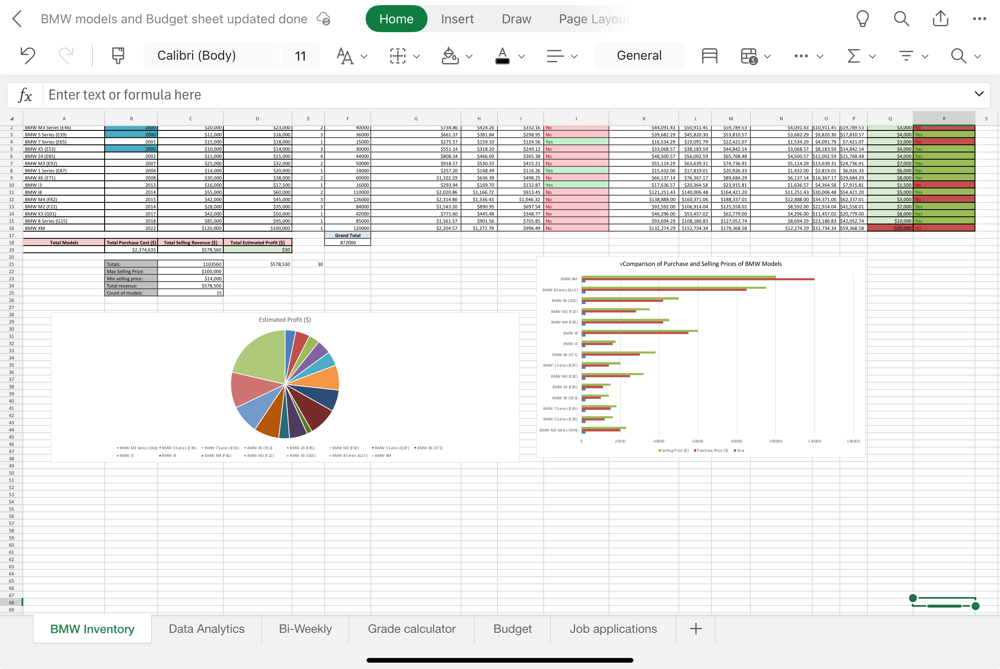
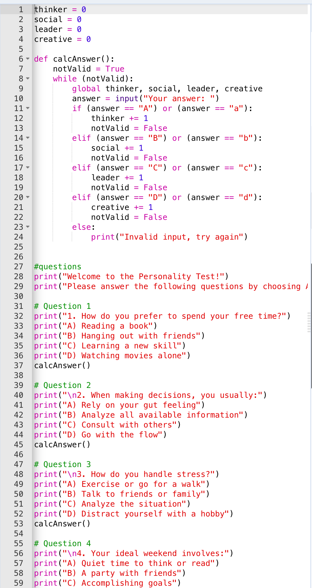
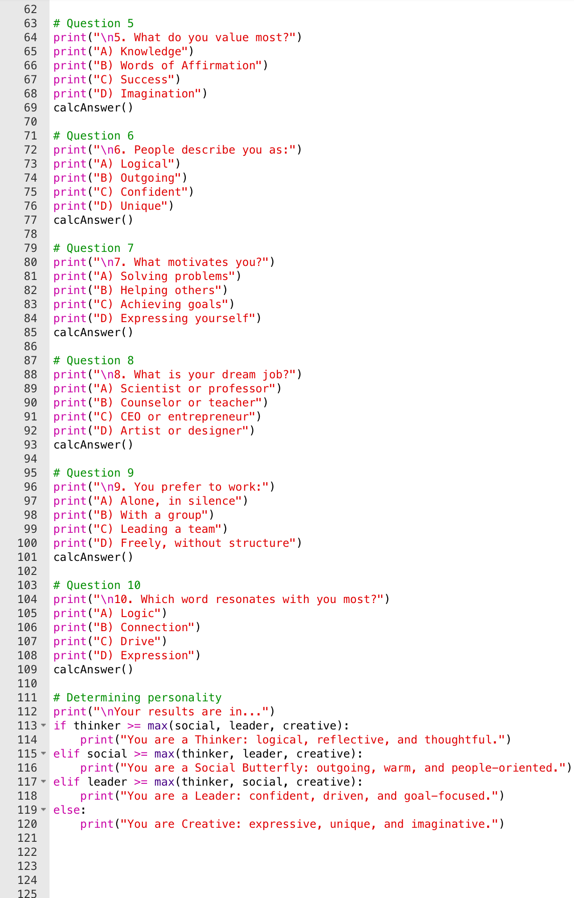
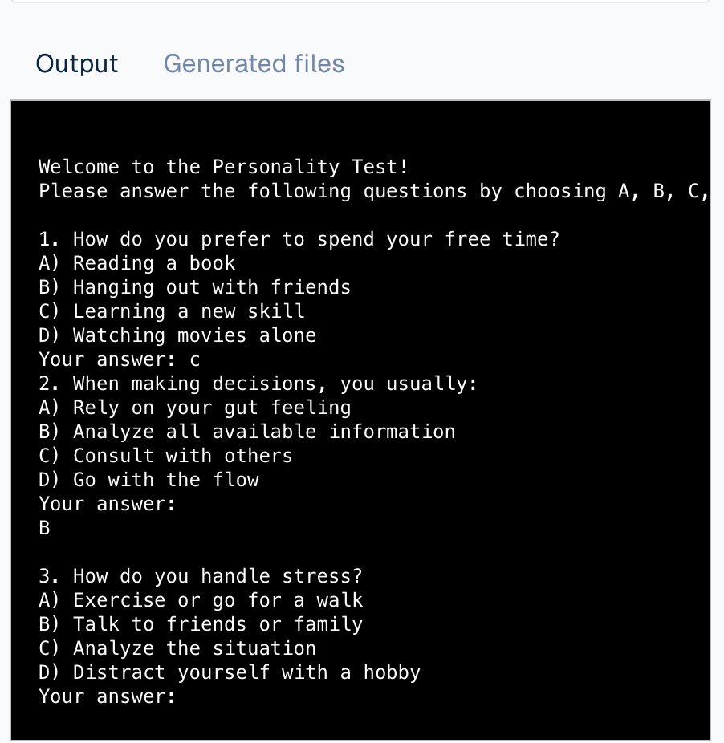
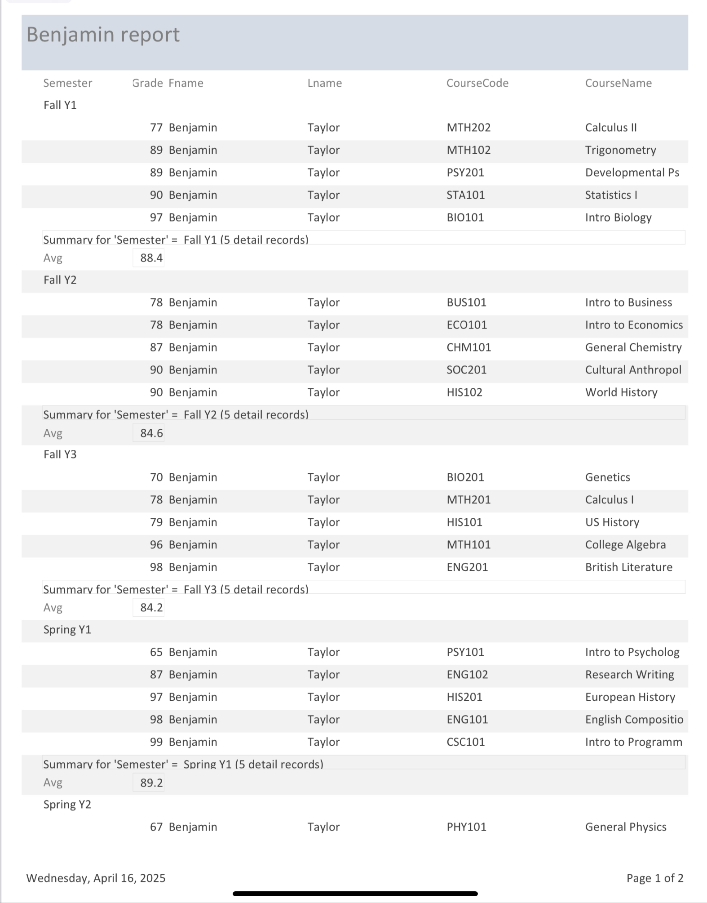
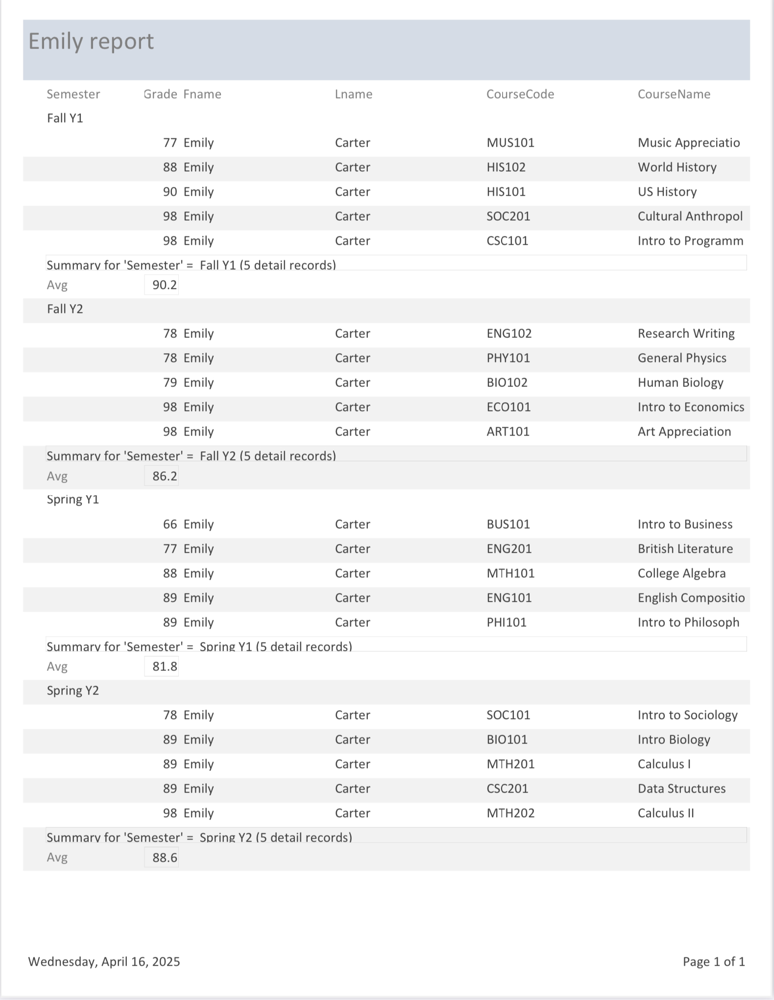

# Hamza Nakib
Contact Info: Instagram: @Hamza_AL.Nakib
### About Me 
Hello! I am a dedicated pre-medical student with a strong academic background and a passion for patient-centered care, developed through extensive shadowing experiences in various clinical settings.
I’ve had the opportunity to shadow physicians in internal medicine, pediatrics, and emergency care, where I observed clinical workflows, patient interactions, and the application of evidence-based medicine. These experiences have deepened my understanding of the medical field and strengthened my skills in empathy, adaptability, and critical thinking.
In addition to my clinical exposure, I bring technical skills in Microsoft Excel, Python programming, and Microsoft Access, which I’ve applied in academic and research settings to analyze data and manage health-related information. I am also comfortable navigating electronic medical records and observing procedural techniques while upholding confidentiality.
My strong work ethic, commitment to compassionate care, and curiosity about the intersection of medicine and technology position me as a future asset to the healthcare field. In my spare time, I enjoy volunteering at local clinics and exploring public health initiatives.

### Education 
Bachelor Degree in BioyHealth, BioTechand and BioPharma
***

### Projects

#### BMW Models and Budget Sheet
 - This Excel project tracks and analyzes 30 BMW models by comparing purchase and selling prices to calculate estimated profits. It includes visualizations like pie and bar charts to highlight trends, totals, and individual model performance.

 - 
 - Project 1: BMW Inventory Analysis (Excel)
Title: BMW Models and Budget Sheet
Tools Used: Microsoft Excel

This project analyzes 30 BMW car models by comparing purchase and selling prices to calculate estimated profits. It uses Excel functions, tables, and visualizations (pie and bar charts) to show profit distribution and performance trends. The final dashboard highlights average prices, total profits, and vehicle counts for clear business insights.
***
#### Personality Type Identifier
 - This project is a personality quiz built in Python using JDoodle, where users answer 10 questions and receive a result categorizing them as a Thinker, Social, Leader, or Creative type based on their answers.

 - 
 - 
 - 
 - Project 2: Personality Quiz Program (Python)
Title: Personality Type Identifier
Tools Used: JDoodle (Python IDE)

A text-based personality quiz developed in Python that asks users 10 multiple-choice questions and classifies them into one of four types—Thinker, Social, Leader, or Creative—based on their responses. The program uses input handling, conditional logic, and basic score aggregation to generate results interactively.

***
#### Semester Grade Report Generator
 - These reports were created in Microsoft Access to track student grades across semesters. They calculate averages and display course performance for each term, providing a clear academic summary for individual students.

 - 
 - 
 - Project 3: Student Grade Reports (Access)
Title: Semester Grade Report Generator
Tools Used: Microsoft Access

This project creates academic progress reports for individual students using Microsoft Access. It organizes course records by semester, calculates averages, and compiles detailed transcripts that summarize performance across subjects and terms for easy academic review and reporting.

